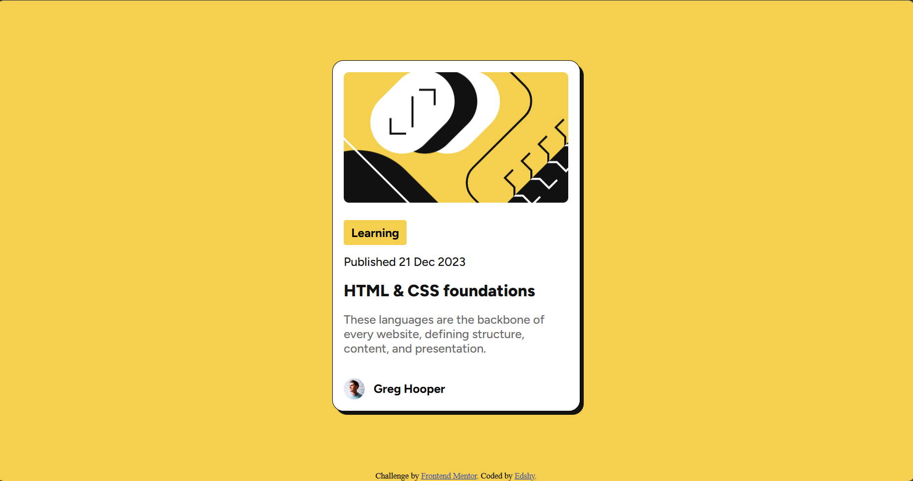

# Frontend Mentor - Blog preview card solution

This is a solution to the [Blog preview card challenge on Frontend Mentor](https://www.frontendmentor.io/challenges/blog-preview-card-ckPaj01IcS).

## Table of contents

- [Overview](#overview)
  - [The challenge](#the-challenge)
  - [Screenshot](#screenshot)
  - [Links](#links)
- [My process](#my-process)
  - [Built with](#built-with)
  - [What I learned](#what-i-learned)
  - [Continued development](#continued-development)
  - [Useful resources](#useful-resources)
- [Author](#author)
- [Acknowledgments](#acknowledgments)

## Overview

### The challenge

Users should be able to:
- See hover and focus states for all interactive elements on the page
- View a responsive blog preview card with author info, article title, date, and category tag
- Have an accessible and visually appealing design across devices

### Screenshot



### Links

- Solution URL: [solution](https://github.com/Edshy/blog-preview-card)
- Live Site URL: [Github page](https://edshy.github.io/blog-preview-card/)

## My process

### Built with

- Semantic HTML5 markup
- CSS custom properties (variables)
- Flexbox for layout

- [Figtree Variable Font](https://fonts.google.com/specimen/Figtree)

### What I learned

- How to use `@font-face` to include variable fonts for better typography control.
- Layering elements to create a shadow effect using absolute positioning.
- Using CSS custom properties for consistent colors and easy theme adjustments.
- Structuring a clean, responsive card layout using Flexbox.
- Example of HTML snippet I’m proud of:

```html
<div class="autor">
  
  Greg Hooper
</div>
```

```css
.shadow {
  position: absolute;
  width: 331.33px;
  height: 100%;
  background-color: var(--Gray-950);
  border-radius: 15px;
  top: 5px;
  left: 5px;
}
```

### Continued development

-Learn more about advanced CSS animations and transitions to enhance interactivity.

-Explore CSS Grid for more complex layouts in future projects.


### Useful resources

- [Frontend Mentor](https://www.frontendmentor.io/challenges/blog-preview-card-ckPaj01IcS)) - Challenge inspiration and guidance.


## Author

- Frontend Mentor - [@Edshy](https://www.frontendmentor.io/profile/Edshy)
- Twitter - [@_vladinho](https://x.com/_vladinho)


## Acknowledgments

Thanks to Frontend Mentor for providing the challenge and inspiration.
Special mention to designers and developers who share their solutions publicly, which helped me learn better practices in structuring and styling components.

